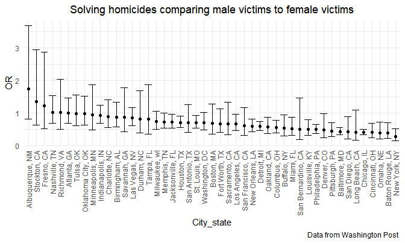
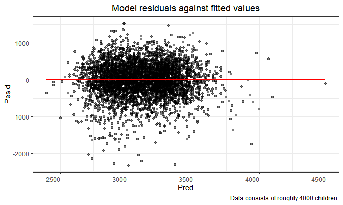
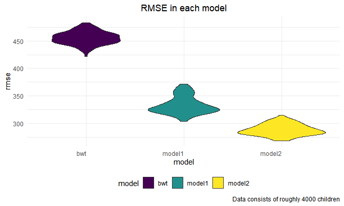

p8105_hw6_al4225
================
Anjing
2022-11-30

## Problem 2

### Raw data

``` r
homicide_data = read_csv("./data/homicide-data.csv",
                col_names = TRUE) %>%
  janitor::clean_names() 
```

    ## Rows: 52179 Columns: 12
    ## ── Column specification ────────────────────────────────────────────────────────
    ## Delimiter: ","
    ## chr (9): uid, victim_last, victim_first, victim_race, victim_age, victim_sex...
    ## dbl (3): reported_date, lat, lon
    ## 
    ## ℹ Use `spec()` to retrieve the full column specification for this data.
    ## ℹ Specify the column types or set `show_col_types = FALSE` to quiet this message.

``` r
homicide_data
```

    ## # A tibble: 52,179 × 12
    ##    uid   repor…¹ victi…² victi…³ victi…⁴ victi…⁵ victi…⁶ city  state   lat   lon
    ##    <chr>   <dbl> <chr>   <chr>   <chr>   <chr>   <chr>   <chr> <chr> <dbl> <dbl>
    ##  1 Alb-…  2.01e7 GARCIA  JUAN    Hispan… 78      Male    Albu… NM     35.1 -107.
    ##  2 Alb-…  2.01e7 MONTOYA CAMERON Hispan… 17      Male    Albu… NM     35.1 -107.
    ##  3 Alb-…  2.01e7 SATTER… VIVIANA White   15      Female  Albu… NM     35.1 -107.
    ##  4 Alb-…  2.01e7 MENDIO… CARLOS  Hispan… 32      Male    Albu… NM     35.1 -107.
    ##  5 Alb-…  2.01e7 MULA    VIVIAN  White   72      Female  Albu… NM     35.1 -107.
    ##  6 Alb-…  2.01e7 BOOK    GERALD… White   91      Female  Albu… NM     35.2 -107.
    ##  7 Alb-…  2.01e7 MALDON… DAVID   Hispan… 52      Male    Albu… NM     35.1 -107.
    ##  8 Alb-…  2.01e7 MALDON… CONNIE  Hispan… 52      Female  Albu… NM     35.1 -107.
    ##  9 Alb-…  2.01e7 MARTIN… GUSTAVO White   56      Male    Albu… NM     35.1 -107.
    ## 10 Alb-…  2.01e7 HERRERA ISRAEL  Hispan… 43      Male    Albu… NM     35.1 -107.
    ## # … with 52,169 more rows, 1 more variable: disposition <chr>, and abbreviated
    ## #   variable names ¹​reported_date, ²​victim_last, ³​victim_first, ⁴​victim_race,
    ## #   ⁵​victim_age, ⁶​victim_sex

### Clean and tidy

Create a city_state variable (e.g. “Baltimore, MD”), and a binary
variable indicating whether the homicide is solved. Omit cities Dallas,
TX; Phoenix, AZ; and Kansas City, MO – these don’t report victim race.
Also omit Tulsa, AL – this is a data entry mistake. For this problem,
limit your analysis those for whom victim_race is white or black. Be
sure that victim_age is numeric.

``` r
homicide = 
  homicide_data %>%
  mutate(
    city_state = str_c(city, ", ", state)) %>%
  mutate(disposition_situation = ifelse(disposition %in% c("Closed without arrest", "Open/No arrest"), "unsolved", "solved"),
         #disposition_situation = as.factor(disposition_situation)
         ) %>%

  filter(!city_state %in% c("Dallas, TX", "Phoenix, AZ", "Kansas City, MO", "Tulsa, AL"), 
         victim_race %in% c("White", "Black")) %>%
  mutate(victim_age = as.numeric(victim_age))
```

    ## Warning in mask$eval_all_mutate(quo): 强制改变过程中产生了NA

``` r
homicide
```

    ## # A tibble: 39,693 × 14
    ##    uid   repor…¹ victi…² victi…³ victi…⁴ victi…⁵ victi…⁶ city  state   lat   lon
    ##    <chr>   <dbl> <chr>   <chr>   <chr>     <dbl> <chr>   <chr> <chr> <dbl> <dbl>
    ##  1 Alb-…  2.01e7 SATTER… VIVIANA White        15 Female  Albu… NM     35.1 -107.
    ##  2 Alb-…  2.01e7 MULA    VIVIAN  White        72 Female  Albu… NM     35.1 -107.
    ##  3 Alb-…  2.01e7 BOOK    GERALD… White        91 Female  Albu… NM     35.2 -107.
    ##  4 Alb-…  2.01e7 MARTIN… GUSTAVO White        56 Male    Albu… NM     35.1 -107.
    ##  5 Alb-…  2.01e7 LUJAN   KEVIN   White        NA Male    Albu… NM     35.1 -107.
    ##  6 Alb-…  2.01e7 GRAY    STEFAN… White        43 Female  Albu… NM     35.1 -107.
    ##  7 Alb-…  2.01e7 DAVID   LARRY   White        52 Male    Albu… NM     NA     NA 
    ##  8 Alb-…  2.01e7 BRITO   ELIZAB… White        22 Female  Albu… NM     35.1 -107.
    ##  9 Alb-…  2.01e7 KING    TEVION  Black        15 Male    Albu… NM     35.1 -107.
    ## 10 Alb-…  2.01e7 BOYKIN  CEDRIC  Black        25 Male    Albu… NM     35.1 -107.
    ## # … with 39,683 more rows, 3 more variables: disposition <chr>,
    ## #   city_state <chr>, disposition_situation <chr>, and abbreviated variable
    ## #   names ¹​reported_date, ²​victim_last, ³​victim_first, ⁴​victim_race,
    ## #   ⁵​victim_age, ⁶​victim_sex

### Logistic regression for Baltimore, MD

For the city of Baltimore, MD, use the glm function to fit a logistic
regression with resolved vs unresolved as the outcome and victim age,
sex and race as predictors.

``` r
Baltimore = 
homicide %>%
  filter(city_state == "Baltimore, MD") %>%
  mutate(
    disposition_situation = ifelse(disposition_situation == "solved", 1, 0),
    victim_race = fct_relevel(victim_race, "White")) %>% 
  select(disposition_situation, victim_age, victim_race, victim_sex)

glm = glm(Baltimore$disposition_situation ~ Baltimore$victim_age + Baltimore$victim_race + Baltimore$victim_sex, 
          family = binomial(link = "logit"))

summary(glm)
```

    ## 
    ## Call:
    ## glm(formula = Baltimore$disposition_situation ~ Baltimore$victim_age + 
    ##     Baltimore$victim_race + Baltimore$victim_sex, family = binomial(link = "logit"))
    ## 
    ## Deviance Residuals: 
    ##     Min       1Q   Median       3Q      Max  
    ## -1.6223  -0.8958  -0.8688   1.4699   1.6579  
    ## 
    ## Coefficients:
    ##                             Estimate Std. Error z value Pr(>|z|)    
    ## (Intercept)                 1.151737   0.236725   4.865 1.14e-06 ***
    ## Baltimore$victim_age       -0.006727   0.003324  -2.024    0.043 *  
    ## Baltimore$victim_raceBlack -0.841756   0.174716  -4.818 1.45e-06 ***
    ## Baltimore$victim_sexMale   -0.854463   0.138176  -6.184 6.26e-10 ***
    ## ---
    ## Signif. codes:  0 '***' 0.001 '**' 0.01 '*' 0.05 '.' 0.1 ' ' 1
    ## 
    ## (Dispersion parameter for binomial family taken to be 1)
    ## 
    ##     Null deviance: 3567.9  on 2752  degrees of freedom
    ## Residual deviance: 3492.7  on 2749  degrees of freedom
    ## AIC: 3500.7
    ## 
    ## Number of Fisher Scoring iterations: 4

### Odds ratio

Apply the broom::tidy to this object; and obtain the estimate and
confidence interval of the adjusted odds ratio for solving homicides
comparing male victims to female victims keeping all other variables
fixed.

**Discription**: For male and female victims, OR = 0.426 \< 1 and is
included in the confidence interval. Sex and solving homicides are
negative related which means men(1) victims tend to have unsolved
homicides. The OR of men victims whose homicides were solved is 0.426
times than women victims. So homicides in which the victim is male are
significantly less like to be resolved than those in which the victim is
female.

``` r
glm %>%
  broom::tidy()
```

    ## # A tibble: 4 × 5
    ##   term                       estimate std.error statistic  p.value
    ##   <chr>                         <dbl>     <dbl>     <dbl>    <dbl>
    ## 1 (Intercept)                 1.15      0.237        4.87 1.14e- 6
    ## 2 Baltimore$victim_age       -0.00673   0.00332     -2.02 4.30e- 2
    ## 3 Baltimore$victim_raceBlack -0.842     0.175       -4.82 1.45e- 6
    ## 4 Baltimore$victim_sexMale   -0.854     0.138       -6.18 6.26e-10

``` r
glm %>%
  broom::tidy() %>%
  mutate(OR = exp(estimate),
         conf.low = exp(estimate - 1.96 * std.error),
         conf.high = exp(estimate + 1.96 * std.error)) %>%
  select(term, log_OR = estimate, OR, p.value, conf.low, conf.high) %>% 
  knitr::kable(digits = 3)
```

| term                                                                                   | log_OR |    OR | p.value | conf.low | conf.high |
|:---------------------------------------------------------------------------------------|-------:|------:|--------:|---------:|----------:|
| (Intercept)                                                                            |  1.152 | 3.164 |   0.000 |    1.989 |     5.031 |
| Baltimore$victim_age | -0.007| 0.993| 0.043| 0.987| 1.000| |Baltimore$victim_raceBlack | -0.842 | 0.431 |   0.000 |    0.306 |     0.607 |
| Baltimore\$victim_sexMale                                                              | -0.854 | 0.426 |   0.000 |    0.325 |     0.558 |

``` r
#confidence interval of OR--all include estimated value
exp(confint(glm))
```

    ## Waiting for profiling to be done...

    ##                                2.5 %    97.5 %
    ## (Intercept)                1.9977110 5.0574051
    ## Baltimore$victim_age       0.9868059 0.9997539
    ## Baltimore$victim_raceBlack 0.3052565 0.6061977
    ## Baltimore$victim_sexMale   0.3241908 0.5575508

### Save result as .RData

Save the output of glm as an R object;

``` r
save(glm, file = "test/glm_baltimore_result.RData")
```

### glm for each city

Now run glm for each of the cities in your dataset, and extract the
adjusted odds ratio (and CI) for solving homicides comparing male
victims to female victims. Do this within a “tidy” pipeline, making use
of purrr::map, list columns, and unnest as necessary to create a
dataframe with estimated ORs and CIs for each city.

``` r
all_cities = 
  homicide %>%
  group_by(city_state) %>% 
  mutate(
    disposition_situation = ifelse(disposition_situation == "solved", 1, 0),
    victim_race = fct_relevel(victim_race, "White")) %>% 
  select(disposition_situation, victim_age, victim_race, victim_sex)
```

    ## Adding missing grouping variables: `city_state`

``` r
all_cities
```

    ## # A tibble: 39,693 × 5
    ## # Groups:   city_state [47]
    ##    city_state      disposition_situation victim_age victim_race victim_sex
    ##    <chr>                           <dbl>      <dbl> <fct>       <chr>     
    ##  1 Albuquerque, NM                     0         15 White       Female    
    ##  2 Albuquerque, NM                     0         72 White       Female    
    ##  3 Albuquerque, NM                     0         91 White       Female    
    ##  4 Albuquerque, NM                     0         56 White       Male      
    ##  5 Albuquerque, NM                     0         NA White       Male      
    ##  6 Albuquerque, NM                     1         43 White       Female    
    ##  7 Albuquerque, NM                     1         52 White       Male      
    ##  8 Albuquerque, NM                     1         22 White       Female    
    ##  9 Albuquerque, NM                     1         15 Black       Male      
    ## 10 Albuquerque, NM                     1         25 Black       Male      
    ## # … with 39,683 more rows

``` r
results_cities = 
  all_cities %>% 
  nest(data = -city_state) %>%
  mutate(
    glm_cities = map(.x = data,
                      ~glm(disposition_situation ~ victim_age + victim_race + victim_sex, data = .x, family = binomial(link = "logit"))),
    tidy_tests = map(.x = glm_cities, ~broom::tidy(.x))
  ) %>%
  select(city_state, tidy_tests) %>% 
  unnest(tidy_tests) %>% 
  mutate(OR = exp(estimate),
         conf.low = exp(estimate - 1.96 * std.error),
         conf.high = exp(estimate + 1.96 * std.error)) %>%
  select(term, log_OR = estimate, OR, p.value,  conf.low, conf.high) 
```

    ## Adding missing grouping variables: `city_state`

``` r
results_cities
```

    ## # A tibble: 193 × 7
    ## # Groups:   city_state [47]
    ##    city_state      term                   log_OR      OR p.value conf.…¹ conf.…²
    ##    <chr>           <chr>                   <dbl>   <dbl>   <dbl>   <dbl>   <dbl>
    ##  1 Albuquerque, NM (Intercept)         1.02      2.79e+0 3.86e-2   1.05    7.36 
    ##  2 Albuquerque, NM victim_age         -0.0197    9.81e-1 3.04e-2   0.963   0.998
    ##  3 Albuquerque, NM victim_raceBlack   -0.412     6.62e-1 3.22e-1   0.293   1.50 
    ##  4 Albuquerque, NM victim_sexMale      0.570     1.77e+0 1.39e-1   0.831   3.76 
    ##  5 Albuquerque, NM victim_sexUnknown -14.6       4.71e-7 9.87e-1   0     Inf    
    ##  6 Atlanta, GA     (Intercept)         1.14      3.12e+0 1.74e-3   1.53    6.36 
    ##  7 Atlanta, GA     victim_age         -0.0116    9.88e-1 1.24e-2   0.979   0.997
    ##  8 Atlanta, GA     victim_raceBlack   -0.269     7.64e-1 3.45e-1   0.438   1.33 
    ##  9 Atlanta, GA     victim_sexMale      0.0000771 1.00e+0 1.00e+0   0.684   1.46 
    ## 10 Baltimore, MD   (Intercept)         1.15      3.16e+0 1.14e-6   1.99    5.03 
    ## # … with 183 more rows, and abbreviated variable names ¹​conf.low, ²​conf.high

### Plot

Create a plot that shows the estimated ORs and CIs for each city.
Organize cities according to estimated OR, and comment on the plot.  
**Descriptions**: According to the plot, Albuquerque, NM has the OR_max
and New York, NY has OR_min. That means the OR(\>1) of solving homicides
comparing male victims to female victims is higher in Albuquerque, NM.
So homicides in which the victim is male are significantly more likely
to be resolved than those in which the victim is female in Albuquerque,
NM.

``` r
results_cities_plot = 
results_cities %>% 
  filter(term == "victim_sexMale") %>%
  group_by(city_state) %>%
  arrange() %>%
  ungroup() %>%
  mutate(city_state = fct_reorder(city_state, OR, .desc = TRUE)) %>% 
  ggplot(aes(x = city_state, y = OR)) +
  geom_point() + 
  geom_errorbar(aes(ymin = conf.low, ymax = conf.high)) + 
  geom_smooth(se = TRUE) +
  labs(
    title = "Solving homicides comparing male victims to female victims",
    x = "City_state",
    y = "OR",
    caption = "Data from Washington Post "
  ) +
  theme(legend.position = "bottom") +
  theme(axis.text.x = element_text(angle = 90, hjust = 1, vjust = .5),
        plot.title = element_text(hjust = 0.5))
results_cities_plot
```

    ## `geom_smooth()` using method = 'loess' and formula 'y ~ x'



## Problem3

### Raw data

Load and clean the data for regression analysis (i.e. convert numeric to
factor where appropriate, check for missing data, etc.).

``` r
birthweight_data = read_csv("./data/birthweight.csv",
                col_names = TRUE) %>%
  janitor::clean_names() %>%
  mutate(babysex = as.factor(babysex),
         frace = as.factor(frace),
         malform = as.factor(malform),
         mrace = as.factor(mrace))
```

    ## Rows: 4342 Columns: 20
    ## ── Column specification ────────────────────────────────────────────────────────
    ## Delimiter: ","
    ## dbl (20): babysex, bhead, blength, bwt, delwt, fincome, frace, gaweeks, malf...
    ## 
    ## ℹ Use `spec()` to retrieve the full column specification for this data.
    ## ℹ Specify the column types or set `show_col_types = FALSE` to quiet this message.

``` r
birthweight_data
```

    ## # A tibble: 4,342 × 20
    ##    babysex bhead blength   bwt delwt fincome frace gaweeks malform menarche
    ##    <fct>   <dbl>   <dbl> <dbl> <dbl>   <dbl> <fct>   <dbl> <fct>      <dbl>
    ##  1 2          34      51  3629   177      35 1        39.9 0             13
    ##  2 1          34      48  3062   156      65 2        25.9 0             14
    ##  3 2          36      50  3345   148      85 1        39.9 0             12
    ##  4 1          34      52  3062   157      55 1        40   0             14
    ##  5 2          34      52  3374   156       5 1        41.6 0             13
    ##  6 1          33      52  3374   129      55 1        40.7 0             12
    ##  7 2          33      46  2523   126      96 2        40.3 0             14
    ##  8 2          33      49  2778   140       5 1        37.4 0             12
    ##  9 1          36      52  3515   146      85 1        40.3 0             11
    ## 10 1          33      50  3459   169      75 2        40.7 0             12
    ## # … with 4,332 more rows, and 10 more variables: mheight <dbl>, momage <dbl>,
    ## #   mrace <fct>, parity <dbl>, pnumlbw <dbl>, pnumsga <dbl>, ppbmi <dbl>,
    ## #   ppwt <dbl>, smoken <dbl>, wtgain <dbl>

``` r
nrow(birthweight_data)
```

    ## [1] 4342

``` r
birthweight_data %>%
  drop_na() %>%
  nrow()
```

    ## [1] 4342

**Discriptions**: There are 4342 observations and 20 variables in this
cleaned dataset. There is no missing data at all.

### Regression

Propose a regression model for birthweight. This model may be based on a
hypothesized structure for the factors that underly birthweight, on a
data-driven model-building process, or a combination of the two.
Describe your modeling process.

According to researches, we have the following information about underly
birthweight.  
1.Age: Mother at the age of 15 or younger or 35 or older brings
complications and birth defects.  
2.Weight: Mothers’ low weight and insufficient nutrition before
delivering can contribute to the low weight of newborns.  
3.Race: It is proven that black women are more likely to give birth to a
child who has a low birth weight.  
4.Smoke: Babies of mothers who are exposed to cigarettes are more likely
to have low birthweight.  
5.fincome: Mothers of lower socioeconomic status are also more likely to
have poorer pregnancy nutrition, inadequate prenatal care, and pregnancy
complications — all factors that can contribute to low birthweight.

So I will choose momage(mother’s age at delivery (years)),
delwt(mother’s weight at delivery (pounds)), smoken(average number of
cigarettes smoked per day during pregnancy), fincome(family monthly
income (in hundreds, rounded)), mrace: mother’s race (1 = White, 2 =
Black, 3 = Asian, 4 = Puerto Rican, 8 = Other) as predictors. In this
model, we just consider the main effects.

``` r
bwt = lm(bwt ~ momage + delwt + mrace + smoken + fincome, data = birthweight_data)
summary(bwt)
```

    ## 
    ## Call:
    ## lm(formula = bwt ~ momage + delwt + mrace + smoken + fincome, 
    ##     data = birthweight_data)
    ## 
    ## Residuals:
    ##      Min       1Q   Median       3Q      Max 
    ## -2330.54  -257.21    16.67   299.02  1532.18 
    ## 
    ## Coefficients:
    ##              Estimate Std. Error t value Pr(>|t|)    
    ## (Intercept) 2303.2200    60.9083  37.815  < 2e-16 ***
    ## momage         0.2564     1.9829   0.129   0.8971    
    ## delwt          6.8360     0.3176  21.527  < 2e-16 ***
    ## mrace2      -349.4011    16.6516 -20.983  < 2e-16 ***
    ## mrace3       -36.8591    71.6466  -0.514   0.6070    
    ## mrace4      -174.0092    31.8245  -5.468 4.81e-08 ***
    ## smoken       -11.9836     0.9722 -12.326  < 2e-16 ***
    ## fincome        0.5497     0.2993   1.837   0.0664 .  
    ## ---
    ## Signif. codes:  0 '***' 0.001 '**' 0.01 '*' 0.05 '.' 0.1 ' ' 1
    ## 
    ## Residual standard error: 458 on 4334 degrees of freedom
    ## Multiple R-squared:  0.2014, Adjusted R-squared:  0.2001 
    ## F-statistic: 156.2 on 7 and 4334 DF,  p-value: < 2.2e-16

### Model table

``` r
bwt %>%
  broom::tidy()
```

    ## # A tibble: 8 × 5
    ##   term        estimate std.error statistic   p.value
    ##   <chr>          <dbl>     <dbl>     <dbl>     <dbl>
    ## 1 (Intercept) 2303.       60.9      37.8   1.11e-270
    ## 2 momage         0.256     1.98      0.129 8.97e-  1
    ## 3 delwt          6.84      0.318    21.5   9.73e- 98
    ## 4 mrace2      -349.       16.7     -21.0   3.50e- 93
    ## 5 mrace3       -36.9      71.6      -0.514 6.07e-  1
    ## 6 mrace4      -174.       31.8      -5.47  4.81e-  8
    ## 7 smoken       -12.0       0.972   -12.3   2.46e- 34
    ## 8 fincome        0.550     0.299     1.84  6.64e-  2

### Plots

Show a plot of model residuals against fitted values – use
`add_predictions` and `add_residuals` in making this plot.  
**Description**: The residual-fitted values plot reflects the normality
of the dots. The dots are randomly scattered around the line y=0, the
dots seem like symmetric. So we can assume the linear regression model
has residuals with the normal distribution.

``` r
residual_plot = 
birthweight_data %>% 
  modelr::add_residuals(bwt) %>%
  modelr::add_predictions(bwt) %>% 
  ggplot(aes(x = pred, y = resid)) + 
  geom_point(alpha = 0.5) +
  geom_smooth(se = F, color = "red", method = "lm") +
  theme_bw() +
  labs(
    title = "Model residuals against fitted values",
    x = "Pred",
    y = "Pesid",
    caption = "Data consists of roughly 4000 children "
  ) +
  theme(legend.position = "bottom") +
  theme(axis.text.x = element_text(hjust = 1, vjust = .5),
        plot.title = element_text(hjust = 0.5))
residual_plot
```

    ## `geom_smooth()` using formula 'y ~ x'



### Two other models

One using length at birth and gestational age as predictors (main
effects only).  
One using head circumference, length, sex, and all interactions
(including the three-way interaction) between these.

``` r
model1 = lm(bwt ~ blength + gaweeks, data = birthweight_data)
model2 = lm(bwt ~ bhead + blength + babysex + bhead*blength + bhead*babysex + blength*babysex + bhead*blength*babysex, data = birthweight_data)

summary(model1)
```

    ## 
    ## Call:
    ## lm(formula = bwt ~ blength + gaweeks, data = birthweight_data)
    ## 
    ## Residuals:
    ##     Min      1Q  Median      3Q     Max 
    ## -1709.6  -215.4   -11.4   208.2  4188.8 
    ## 
    ## Coefficients:
    ##              Estimate Std. Error t value Pr(>|t|)    
    ## (Intercept) -4347.667     97.958  -44.38   <2e-16 ***
    ## blength       128.556      1.990   64.60   <2e-16 ***
    ## gaweeks        27.047      1.718   15.74   <2e-16 ***
    ## ---
    ## Signif. codes:  0 '***' 0.001 '**' 0.01 '*' 0.05 '.' 0.1 ' ' 1
    ## 
    ## Residual standard error: 333.2 on 4339 degrees of freedom
    ## Multiple R-squared:  0.5769, Adjusted R-squared:  0.5767 
    ## F-statistic:  2958 on 2 and 4339 DF,  p-value: < 2.2e-16

``` r
summary(model2)
```

    ## 
    ## Call:
    ## lm(formula = bwt ~ bhead + blength + babysex + bhead * blength + 
    ##     bhead * babysex + blength * babysex + bhead * blength * babysex, 
    ##     data = birthweight_data)
    ## 
    ## Residuals:
    ##      Min       1Q   Median       3Q      Max 
    ## -1132.99  -190.42   -10.33   178.63  2617.96 
    ## 
    ## Coefficients:
    ##                          Estimate Std. Error t value Pr(>|t|)    
    ## (Intercept)            -7176.8170  1264.8397  -5.674 1.49e-08 ***
    ## bhead                    181.7956    38.0542   4.777 1.84e-06 ***
    ## blength                  102.1269    26.2118   3.896 9.92e-05 ***
    ## babysex2                6374.8684  1677.7669   3.800 0.000147 ***
    ## bhead:blength             -0.5536     0.7802  -0.710 0.478012    
    ## bhead:babysex2          -198.3932    51.0917  -3.883 0.000105 ***
    ## blength:babysex2        -123.7729    35.1185  -3.524 0.000429 ***
    ## bhead:blength:babysex2     3.8781     1.0566   3.670 0.000245 ***
    ## ---
    ## Signif. codes:  0 '***' 0.001 '**' 0.01 '*' 0.05 '.' 0.1 ' ' 1
    ## 
    ## Residual standard error: 287.7 on 4334 degrees of freedom
    ## Multiple R-squared:  0.6849, Adjusted R-squared:  0.6844 
    ## F-statistic:  1346 on 7 and 4334 DF,  p-value: < 2.2e-16

### Comparison

Make this comparison in terms of the cross-validated prediction error;
use crossv_mc and functions in purrr as appropriate.  
The RMSEs are suggestive that the two other models work better than the
first model bwt, and that the model2 is better than the model1.

``` r
#Compute root mean squared errors (RMSEs) for each model.
rmse(bwt, birthweight_data)
```

    ## [1] 457.6245

``` r
rmse(model1, birthweight_data)
```

    ## [1] 333.1023

``` r
rmse(model2, birthweight_data)
```

    ## [1] 287.4692

``` r
#CV
cv_df = 
  crossv_mc(birthweight_data, 100) %>%
  mutate(
    bwt  = map(train, ~lm(bwt ~ momage + delwt + mrace + smoken + fincome, data = .x)),
    model1  = map(train, ~lm(bwt ~ blength + gaweeks, data = .x)),
    model2  = map(train, ~lm(bwt ~ bhead + blength + babysex + bhead*blength + bhead*babysex + blength*babysex + bhead*blength*babysex, , data = .x))) %>% 
  mutate(
    rmse_bwt = map2_dbl(bwt, test, ~rmse(model = .x, data = .y)),
    rmse_model1 = map2_dbl(model1, test, ~rmse(model = .x, data = .y)),
    rmse_model2 = map2_dbl(model2, test, ~rmse(model = .x, data = .y)))
```

### Plot

**Description**:  
The plot below shows the distribution of RMSE values for each candidate
model. now we get a sense of variance in prediction error and can
compare prediction error distributions across methods. According to the
plot, model bwt has the highest RMSE, model2(one using head
circumference, length, sex, and all interactions (including the
three-way interaction) between these) has the lowest RMSE. So the best
model is model2.

``` r
RMSE_plot = 
cv_df %>% 
  select(starts_with("rmse")) %>% 
  pivot_longer(
    everything(),
    names_to = "model", 
    values_to = "rmse",
    names_prefix = "rmse_") %>% 
  mutate(model = fct_inorder(model)) %>% 
  ggplot(aes(x = model, y = rmse)) + 
  geom_violin(aes(fill = model)) +
  labs(
    title = "RMSE in each model",
    caption = "Data consists of roughly 4000 children"
  ) +
  theme(legend.position = "bottom") +
  theme(axis.text.x = element_text(hjust = 1, vjust = .5),
        plot.title = element_text(hjust = 0.5))
RMSE_plot
```


